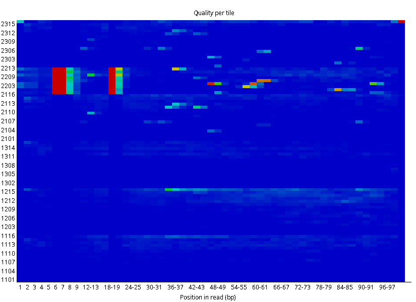
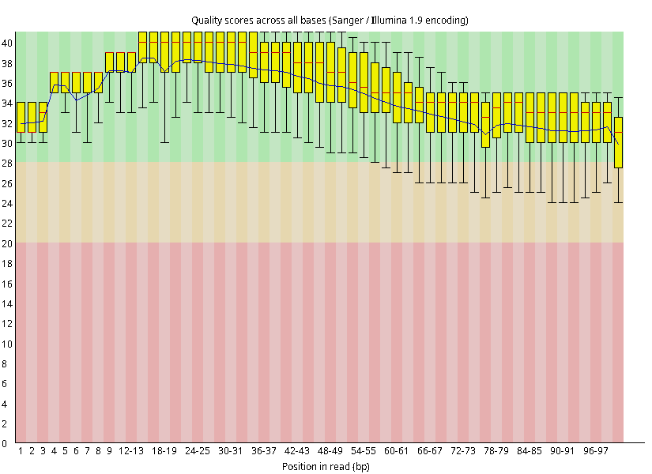
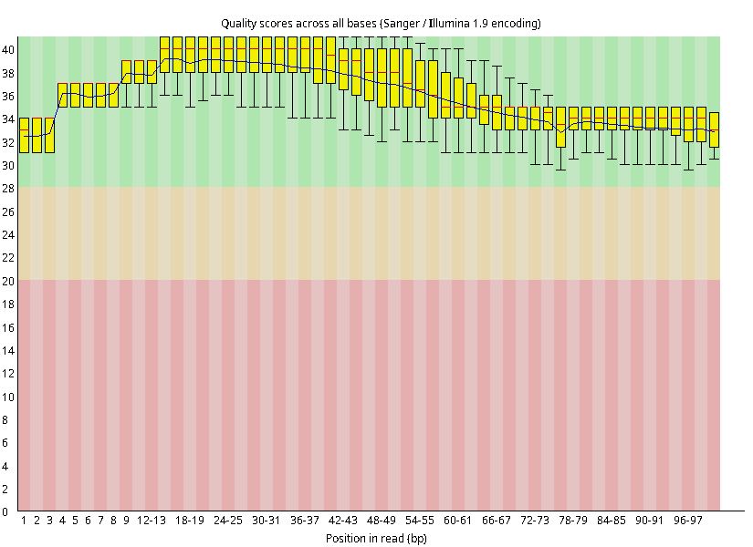
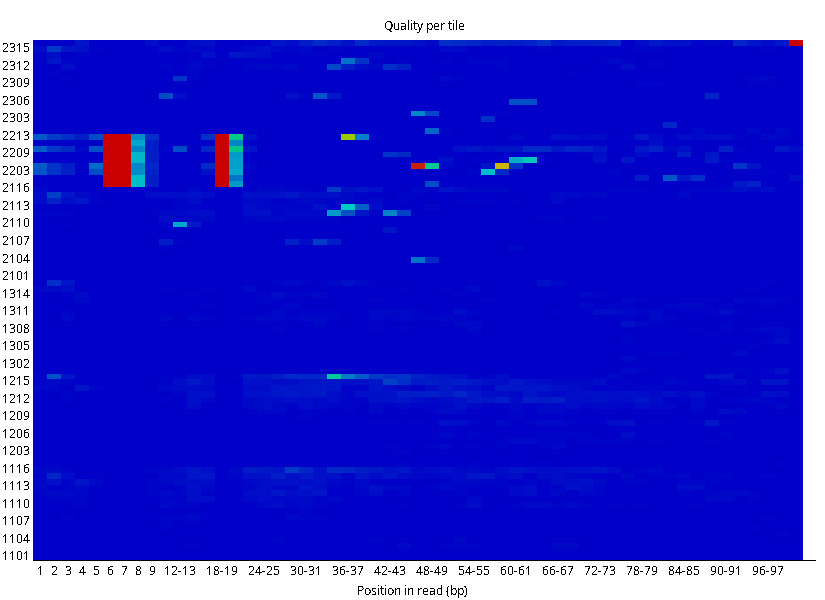
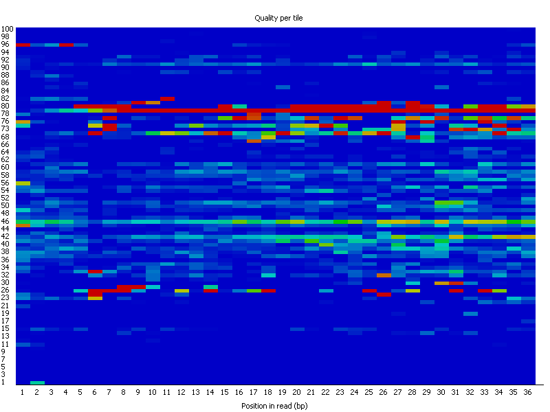

# FASTQ_titles
**Проблема**
Низкое качество позиции в чтениях, наблюдаемое при анализе коротких чтений с помощью FASTQC в разделе "Per tile sequence quality". 
Пример ниже - качество BAD. Низкое качество в средней позиции (5-9 нт. или 18-24 нт.)

BAD качество

Здесь подробнее о ["Per Tile Sequence Quality"]( https://www.bioinformatics.babraham.ac.uk/projects/fastqc/Help/3%20Analysis%20Modules/12%20Per%20Tile%20Sequence%20Quality.html) 

Обычно этот параметр игнорируется, например, в ассемблерах учитывается низкое качество считанных элементов (вычисляется процент всех вариантов, и больший вклад дают элементы высокого качества).  Но если глубокое секвенирование проводится для поиска редких мутаций, то любая ошибка должна быть удалена на этапе очистки чтений.

**Решение.** Фильтрация ридов по тайлам

**Вопрос требующие разрешения**
**На основе каких данных будет удалены прочтения?**
График "Per Tile Sequence Quality" отображает тайл и позицию которая имеет аномально низкое качество относительно среднего качества всех тайлов по позиции (взято отсюда ["Per Tile Sequence Quality"]( https://www.bioinformatics.babraham.ac.uk/projects/fastqc/Help/3%20Analysis%20Modules/12%20Per%20Tile%20Sequence%20Quality.html))
В таком случае мы рассматриваем относительное качество. А мы задались вопросом взять только хорошие прочтения. К тому же если мы сделаем фильтр по тайлам, то можем удалить и прочтения хорошего качества. 

Поэтому предлагаю немного пересмотреть задачу.

Нужно понять на каком уровне наблюдается низкое качество чтения. Вот несколько уровней записи идентификатора (первой строки в fastq файле) от большего размера к меньшему (более подробно [здесь](https://zjuwhw.github.io/2016/08/13/Illumina_sequencer.html)): 
* instrument 
* run_number 
* flowcell_id
* lane
* tile
* x_pos and y_pos

Согласно [FASTQC](https://www.bioinformatics.babraham.ac.uk/projects/fastqc/Help/3%20Analysis%20Modules/12%20Per%20Tile%20Sequence%20Quality.html) ошибки возникают на уровне tile в результате засорения, пузырьков, пятен или перегруженности тайла. Однако, что если высокие ошибки возникают в определенном кластере по x и y позициям. Тогда мы можем удалить кластер, вместо всей плитки. Чтобы это проверить нужно визулизировать ошибки на уровне кластеров для тайлов. 

Было выбрано два тайла и визулизировано качество чтений. Горизонтально расположены координаты в тайле, по вертикали длина рида. Цветом показано качество прочтенного нуклеотида. 

**1101 (по позициям качество тайла выше среднего)**
.png)

**2203 (по позициям есть два региона с качеством ниже среднего)**
.png)

Выглядит круто! Действительно, прочтения с плохим качеством локализуются. Если хотие покрутить график то в папке Graphs есть html страницы с меньшим кол-вом прочтений (100 шт) Tile_1101(100) и Tile_2203(100), что позволяет его открыть на любом компьютере и рассмотреть. Если открыть Tile_1101(all), то комп долго будет грузиться.

Для повышения качества прочтений с ячейки 1101 достаточно тримминга. А вот для 2203 видно низкое качество около ~10, ~20 и ~40 нт. И не ясно как решать такую проблему, если хотим сохранить максимальное кол-во качественны прочтений. 

Поэтому для данного случая, когда рассматриваем на уровне каждого прочтения, удалять целый тайл не стоит, лучше каждое прочтение через trimomatic пройтись.

Trimmomatic параметры (LEADING:30 TRAILING:30 SLIDINGWINDOW:10:30 MINLEN:20)

| До тримминга       | После тримминга    |
|--------------------|--------------------|
|  |  |
|  |  |

Где-то качество тайлов улучшилось, где-то осталось таким же, хотя работать с прочтения после тримминга уже можно смело. 

Однако бывают случаи, когда фильтр по ячейкам дейтсвительно нужен. Например тут. (картинка с "битыми" тайлами взята из инета, поэтому не смогу на ней демонстрировать, хотя хотелось бы)

Когда ячейки стабильно "проседают" по качеству. Тогда кажется их можно удалить.
Однако, думаю, trimomatic эту проблему тоже может решить. Он просто выбросит все чтения, которые не пройдут проверку на MINLEN.

Поэтому писать новый тул, чтобы делать фильтр по тайлам, возможно не требуется. Однако, если я здесь допустил ошибки или есть другие соображения, то пожалуйста напиши мне. Мне будет интересно попрактиковаться в кодинге тулов.

